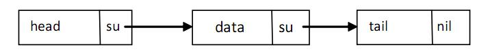

go中通过类型别名和结构体创建用户自定义类型

结构体是复合类型（composite types），当需要定义一个类型，它由一系列属性组成，每个属性都有自己的类型和值的时候，就应该使用结构体，它把数据聚集在一起。

结构体是值类型，可以通过new来创建

组成结构体类型的数据被成为字段(fields)，每个字段都有一个类型和名字，在一个结构体中，字段的名字必须是唯一的。

# 结构体定义
结构体定义的一般方式如下：

```go
type identifier struct {
    field1 type1
    field2 type2
    ...
}
```

`type T struct {a, b int}` 也是合法的语法，它更适用于简单的结构体。

结构体的字段可以是任何类型(结构体，函数，接口)

使用new为结构体分配内存，他返回已分配内存的指针`var t *T = new(T)`，也可以放在不同行（比如定义是包范围的，但是分配却没有必要在开始就做）。

```go
var t *T    //声明
t = new(T)  //分配内存
```

惯用方法是：`t := new(T)`，变量 `t` 是一个指向 `T`的指针，此时结构体字段的值是它们所属类型的零值。

声明 `var t T` 也会给 `t` 分配内存，并零值化内存，这时候`t` 是类型 T 。

使用`.`获取结构体字段的值的方式在go中称为**选择器**，不论是一个结构体类型或者指针，都能用同样的选择器符来引用结构体的字段

初始化一个结构体字面量

```go
    ms := &struct1{10, 15.5, "Chris"}
    // 此时 ms 的类型是 *struct1
```
`&struct1{a, b, c}` 是一种简写，底层仍然会调用 `new ()`，这里值的顺序必须按照字段顺序来写。表达式 `new(Type)` 和 `&Type{}` 是等价的。

通过在值的前面放上字段名来初始化字段的方式：
下图说明了结构体类型实例和一个指向它的指针的内存布局：

```go
type Point struct { x, y int }
```

使用 new 初始化：


作为结构体字面量初始化：


**结构体的内存布局**

Go 语言中，结构体和它所包含的数据在内存中是以连续块的形式存在的，即使结构体中嵌套有其他的结构体，这在性能上带来了很大的优势。

```go
type Rect1 struct {Min, Max Point }
type Rect2 struct {Min, Max *Point }
```


**递归结构体**

结构体类型可以通过引用自身来定义。这在定义链表或二叉树的元素（通常叫节点）时特别有用，此时节点包含指向临近节点的链接（地址）。如下所示，链表中的 `su`，树中的 `ri` 和 `le` 分别是指向别的节点的指针。

链表：




这块的 `data` 字段用于存放有效数据（比如 float64），`su` 指针指向后继节点。

Go 代码：

```go
type Node struct {
    data    float64
    su      *Node
}
```

**结构体的转换**
当为结构体定义了一个 alias 类型时，此结构体类型和它的 alias 类型都有相同的底层类型，他们可以相互转换

# 使用工厂方法创建结构体实例
go中可以实现“构造子工厂”的方法，工厂的名字一new或New开头

下面是这个结构体类型对应的工厂方法，它返回一个指向结构体实例的指针：

```go
type File struct {
    fd      int     // 文件描述符
    name    string  // 文件名
}

func NewFile(fd int, name string) *File {
    if fd < 0 {
        return nil
    }

    return &File{fd, name}
}
```

然后这样调用它：

```go
f := NewFile(10, "./test.txt")
```

在 Go 语言中常常像上面这样在工厂方法里使用初始化来简便的实现构造函数。

如果 `File` 是一个结构体类型，那么表达式 `new(File)` 和 `&File{}` 是等价的。

如果想知道结构体类型 T 的一个实例占用了多少内存，可以使用：`size := unsafe.Sizeof(T{})`。

**如何强制使用工厂方法**

通过应用可见性规则参考就可以禁止使用 new 函数，强制用户使用工厂方法，从而使类型变成私有的。

```go
type matrix struct {
    ...
}

func NewMatrix(params) *matrix {
    m := new(matrix) // 初始化 m
    return m
}
```

在其他包里使用工厂方法：

```go
package main
import "matrix"
...
wrong := new(matrix.matrix)     // 编译失败（matrix 是私有的）
right := matrix.NewMatrix(...)  // 实例化 matrix 的唯一方式
```

##  map 和 struct vs new() 和 make()
[new_make.go](examples/chapter_10/new_make.go)

# 使用自定义包中的结构体

# 带标签的结构体
结构体中的字段除了有名字和类型外，还可以有一个可选的标签（tag）：它是一个附属于字段的字符串，可以是文档或其他的重要标记。

标签的内容不可以在一般的编程中使用，只有包 `reflect` 能获取它,如果变量是一个结构体类型，就可以通过 Field 来索引结构体的字段，然后就可以使用 Tag 属性。

[struct_tag.go](examples/chapter_10/struct_tag.go)
```go
package main

import (
	"fmt"
	"reflect"
)

type TagType struct { //  tags
	field1 bool   "An important answer"
	field2 string "The name of the thing"
	field3 int    "How much there are"
}

func main() {
	tt := TagType{true, "Barak Obama", 1}
	for i := 0; i < 3; i++ {
		refTag(tt, i)
	}
}

func refTag(tt TagType, ix int) {
	ttType := reflect.TypeOf(tt)
	ixField := ttType.Field(ix)
	fmt.Printf("%v\n", ixField.Tag)
}

/* Output:
An important answer
The name of the thing
How much there are
*/
```
# 匿名字段和内嵌结构体
## 匿名字段
结构体可以包含匿名的字段，字段的类型是必须的，此时类型就是字段的名字。

每一种数据数据类型只能能有一个匿名字段。

 [structs_anonymous_fields.go](examples/chapter_10/structs_anonymous_fields.go)：

```go
package main

import "fmt"

type innerS struct {
	in1 int
	in2 int
}

type outerS struct {
	b      int
	c      float32
	int    // anonymous field
	innerS // anonymous field
}

func main() {
	outer := new(outerS)
	outer.b = 6
	outer.c = 7.5
	outer.int = 60
	outer.in1 = 5
	outer.in2 = 10

	fmt.Printf("outer.b is: %d\n", outer.b)
	fmt.Printf("outer.c is: %f\n", outer.c)
	fmt.Printf("outer.int is: %d\n", outer.int)
	fmt.Printf("outer.in1 is: %d\n", outer.in1)
	fmt.Printf("outer.in2 is: %d\n", outer.in2)
	// with a struct-literal:
	outer2 := outerS{6, 7.5, 60, innerS{5, 10}}
	fmt.Println("outer2 is: ", outer2)

}

```
## 内嵌结构体
结构体作为匿名字段时，可以通过`.`的方式访问内层结构体字段

## 命名冲突
当两个字段拥有相同的名字：

1. 外层名字会覆盖内层名字（但是两者的内存空间都保留），这提供了一种重载字段或方法的方式；
2. 如果相同的名字在同一级别出现了两次，如果这个名字被程序使用了，将会引发一个错误（不使用没关系）。没有办法来解决这种问题引起的二义性，必须由程序员自己修正。
   
例子：

```go
type A struct {a int}
type B struct {a, b int}

type C struct {A; B}
var c C
```

规则 2：使用 `c.a` 是错误的，到底是 `c.A.a` 还是 `c.B.a` 呢？会导致编译器错误：**ambiguous DOT reference c.a disambiguate with either c.A.a or c.B.a**。

```go
type D struct {B; b float32}
var d D
```

规则1：使用 `d.b` 是没问题的：它是 float32，而不是 `B` 的 `b`。如果想要内层的 `b` 可以通过 `d.B.b` 得到。
# 方法
## 方法是什么
go的方法是作用在接受者上的一个函数，接受者可以是任何类型(结构体，函数，int、数组)，但可以是一个接口。

一个类型加上它的方法等同于面向对象中的一个类。类和它的方法必须在一个包。

因为方法是函数，所以同样的，不允许方法重载，即对于一个类型只能有一个给定名称的方法。但是如果基于接收者类型，是有重载的：具有同样名字的方法可以在 2 个或多个不同的接收者类型上存在，比如在同一个包里这么做是允许的：

```go
func (a *denseMatrix) Add(b Matrix) Matrix
func (a *sparseMatrix) Add(b Matrix) Matrix
```
类型和作用在它上面定义的方法必须在同一个包里定义，所以不能在 int、float 或类似这些的类型上定义方法。

**别名类型没有原始类型上已经定义过的方法。**


定义方法的一般格式如下：

```go
func (recv receiver_type) methodName(parameter_list) (return_value_list) { ... }
```

在方法名之前，`func` 关键字之后的括号中指定 receiver。

如果 `recv` 是 receiver 的实例，Method1 是它的方法名，那么方法调用遵循传统的 `object.name` 选择器符号：**recv.Method1()**。

如果 `recv` 是一个指针，**Go 会自动解引用**。

如果方法不需要使用 `recv` 的值，可以用 **_** 替换它，比如：

```go
func (_ receiver_type) methodName(parameter_list) (return_value_list) { ... }
```

`recv` 就像是面向对象语言中的 `this` 或 `self`，但是 Go 中并没有这两个关键字。随个人喜好，你可以使用 `this` 或 `self` 作为 receiver 的名字。

## 函数和方法的区别
函数将变量作为参数：**Function1(recv)**

方法在变量上被调用：**recv.Method1()**

在接收者是指针时，方法可以改变接收者的值（或状态）和函数一样（当参数作为指针传递，即通过引用调用时，函数也可以改变参数的状态）。

**不要忘记 Method1 后边的括号 ()，否则会引发编译器错误：`method recv.Method1 is not an expression, must be called`**

接收者必须有一个显式的名字，这个名字必须在方法中被使用。

**receiver_type** 叫做 **（接收者）基本类型**，这个类型必须在和方法同样的包中被声明。

在 Go 中，（接收者）类型关联的方法不写在类型结构里面，就像类那样；耦合更加宽松；类型和方法之间的关联由接收者来建立。

**方法没有和数据定义（结构体）混在一起：它们是正交的类型；表示（数据）和行为（方法）是独立的。**

## 指针或值作为接受者
鉴于性能的原因，`recv` 最常见的是一个指向 receiver_type 的指针（因为我们不想要一个实例的拷贝，如果按值调用的话就会是这样），特别是在 receiver 类型是结构体时，就更是如此了。

如果想要方法改变接收者的数据，就在接收者的指针类型上定义该方法。否则，就在普通的值类型上定义方法。

**指针方法和值方法都可以在指针或非指针上被调用**

 [methodset1.go](examples/chapter_10/methodset1.go)：

## 方法和未导出字段
类型被导出，字段没有被导出时，通过面向对象语言一个众所周知的技术来完成：提供 getter 和 setter 方法。对于 setter 方法使用** Set 前缀**，对于 getter 方法只使用**成员名**。

## 内嵌类型的方法和继承
匿名类型被内嵌在结构体中时，匿名类型的可见方法同样被内嵌，等效于外层类型**继承**了这些方法

内嵌将一个已存在类型的字段和方法注入到了另一个类型里：匿名字段上的方法“晋升”成为了外层类型的方法。当然类型可以有只作用于本身实例而不作用于内嵌“父”类型上的方法。

可以覆写方法（像字段一样）：和内嵌类型方法具有同样名字的外层类型的方法会覆写内嵌类型对应的方法。

结构体内嵌和自己在同一个包中的结构体时，可以彼此访问对方所有的字段和方法。
## 在类型中嵌入功能
主要有两种方法来实现在类型中嵌入功能：

A：聚合（或组合）：包含一个所需功能类型的具名字段。

B：内嵌：内嵌（匿名地）所需功能类型，像前一节 10.6.5 所演示的那样。

### 聚合
[embed_func1.go](examples/chapter_10/embed_func1.go)

### 内嵌
[embed_func2.go](examples/chapter_10/embed_func2.go)

## 多重继承
# 类型的String()方法

# 垃圾回收和SetFinalizer