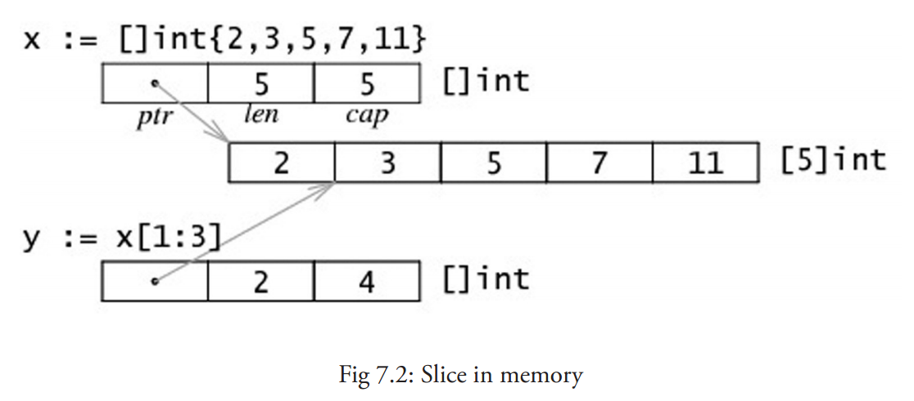
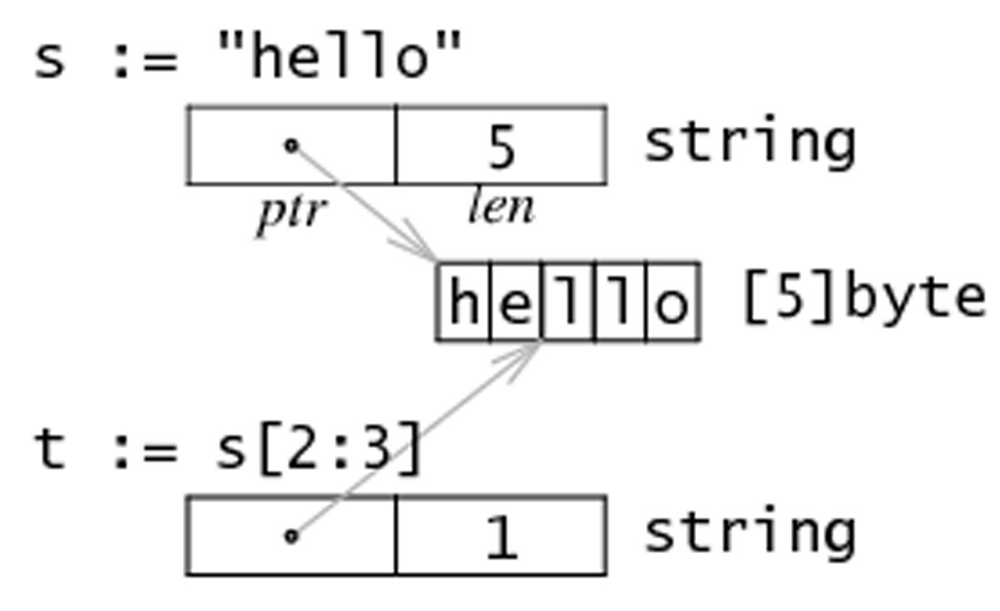

容器是可以包含大量条目（item）的数据结构，例如数组、切片和 map。从这看到 Go 明显受到 Python 的影响

以`[]`符号标识的数组类型几乎在所有的编程语言中都是一个基本主力。Go 语言中的数组也是类似的，只是有一些特点。Go 没有 C 那么灵活，但是拥有切片（slice）类型。这是一种建立在 Go 语言数组类型之上的抽象，要想理解切片我们必须先理解数组。数组有特定的用处，但是却有一些呆板，所以在 Go 语言的代码里并不是特别常见。相对的，切片却是随处可见的。它们构建在数组之上并且提供更强大的能力和便捷。
# 声明和初始化
## 概念
1. 数组是具有相同 **唯一类型** 的一组已编号且**长度固定**的数据项序列（这是一种同构的数据结构）；
2. 数组长度**必须是一个常量表达式**，并且必须是一个非负整数。
3. 数组长度也是数组类型的一部分，所以 `[5]int` 和 `[10]int` 是属于不同类型的。

**注意事项** 如果我们想让数组元素类型为任意类型的话可以使用空接口作为类型。当使用值时我们必须先做一个类型判断

数组元素可以通过 **索引**（位置）来读取（或者修改），元素的数目（也称为长度或者数组大小）必须是固定的并且在声明该数组时就给出（编译时需要知道数组长度以便分配内存）；数组长度最大为 2GB。

声明的格式是： 

```go
var identifier [len]type
// var identifier []type 这是切片
```

Go 语言中的数组是一种 **值类型**，可以通过 `new()` 来创建： `var arr1 = new([5]int)`。

`var arr1 = new([5]int)`和 `var arr2 [5]int` 的区别：arr1 的类型是 `*[5]int`，而 arr2 的类型是 `[5]int`。

在函数中数组作为参数传入时，如 `func1(arr2)`，会产生一次数组拷贝，func1 方法不会修改原始的数组 arr2。

 arr2 必须通过&操作符以引用方式传过来才能修改数组，例如 func1(&arr2）

## 数组常量
初始化数组

第一种：

```go
var arrAge = [5]int{18, 20, 15, 22, 16}
```

注意 `[5]int` 可以从左边起开始忽略：`[10]int {1, 2, 3}` :这是一个有 10 个元素的数组，除了前三个元素外其他元素都为 0。

第二种：

```go
var arrLazy = [...]int{5, 6, 7, 8, 22}
```

`...` 同样可以忽略，从技术上说它们其实变成了切片。

第三种：`key: value 语法`

```go
var arrKeyValue = [5]string{3: "Chris", 4: "Ron"}
```

只有索引 3 和 4 被赋予实际的值，其他元素都被设置为空的字符串

## 多维数组

## 将数组传递给函数
把一个大数组传递给函数会消耗很多内存。有两种方法可以避免这种情况：

- 传递数组的指针
- 使用数组的切片

# 切片
## 概念
切片是引用类型，表示对数组连续片段的引用（相关数组，也称匿名数组），切片提供了相关数组的动态窗口，切片的长度可变的（数组不可变）。

切片是可索引的，可以通过`len()`获取切片长度，`cap()`表示切片容量，容量=切片长度+切片之外数组的长度。切片的长度永远不会超过它的容量，所以对于切片 s 来说该不等式永远成立：`0 <= len(s) <= cap(s)`。

多个切片如果表示同一个数组的片段，它们可以**共享数据**；因此一个切片和相关数组的其他切片是共享存储的，相反，不同的数组总是代表不同的存储。数组实际上是切片的构建块。

声明切片的格式是： `var identifier []type`（不需要说明长度）。一个切片在未初始化之前默认为 nil，长度为 0。

切片的初始化格式是：`var slice1 []type = arr1[start:end]`。这表示 slice1 是由数组 arr1 从 `start` 索引到 `end-1` 索引之间的元素构成的子集（切分数组，start:end 被称为 slice 表达式）。

在进行切片时，你可以利用它的默认行为来忽略上下界。

切片下界的默认值为 0，上界则是该切片的长度。
对于数组
```
var a [10]int
```
来说，以下切片是等价的：
```
a[0:10]
a[:10]
a[0:]
a[:]
```
切片在内存中的组织方式实际上是一个有 3 个域的结构体：指向相关数组的指针，切片长度以及切片容量。下图给出了一个长度为 2，容量为 4 的切片 y。

- 切片 `y[0:4]` 由 元素 3，5，7 和 11 组成。
- `y[0] = 3` 且 `y[1] = 5`。



切片只能后移不能前移
```go
package main

import "fmt"

func main() {
	s := []int{2, 3, 5, 7, 11, 13}

	s = s[1:4]	//[3 5 7]

	s = s[:2]	//[3 5]

	s = s[1:]	//[5]
}
```

字符串是纯粹不可变的字节数组，它们也可以被切分成切片。

## 将切片传递给函数
把函数参数声明为切片，调用函数时，把数组分片，创建一个数组的引用传递给函数
```go
package main

import "fmt"

func main() {
	var arr = [5]int{0, 1, 2, 3, 4}
	arr_change(arr[:])	// 传递切片 arr[:]
	fmt.Println(arr)	//[0 2 4 6 8]
}

func arr_change(arr []int) {
	for i := range arr {
		arr[i] *= 2
	}
}
```

## 用make()创建一个切片
make 的使用方式是：`func make([]T, len, cap)`，make 接受 2 个参数：元素的类型以及切片的元素个数，其中 cap 是可选参数。

当相关数组还没有定义时，我们可以使用 make() 函数来创建一个切片，同时创建好相关数组：`var slice1 []type = make([]type, len)`。简写为 `slice1 := make([]type, len)`，这里 `len` 是数组的长度并且也是 `slice` 的初始长度,`cap(slice1) == len(slice1) == len`

如果你想创建一个 slice1，它不占用整个数组，而只是占用以 len 为个数个项，那么只要：`slice1 := make([]type, len, cap)`。

所以下面两种方法可以生成相同的切片:

```go
make([]int, 50, 100)
new([100]int)[0:50]
```

下图描述了使用 make 方法生成的切片的内存结构：


## new()和make()的区别
`new (T)`为每个新的类型 T 分配一片内存，初始化为 0 并且返回类型为 * T 的内存地址：这种方法 返回一个指向类型为 T，值为 0 的地址的指针，它适用于值类型如数组和结构体，它相当于 &T{}。
`make()`返回一个类型为T的初始值，它只适用于3种内建引用类型(slice,map,channel)


## 多维切片
和数组一样，切片通常也是一维的，但是也可以由一维组合成高维。通过分片的分片（或者切片的数组），长度可以任意动态变化，所以 Go 语言的多维切片可以任意切分。而且，内层的切片必须单独分配（通过 make 函数）。
## bytes包

# for-range结构
这种构建方法可以应用于数组和切片:

```go
for ix, value := range slice1 {
	...
}
```

第一个返回值`ix`是数组或者切片的索引，第二个是在该索引位置的值；他们都是仅在 for 循环内部可见的局部变量`value`只是`slice1`某个索引位置的值的一个拷贝，不能用来修改`slice1`该索引位置的值,修改值使用`slice[i]=`的形式

需要索引，你可以忽略第二个变量，例如：

```go
for ix := range seasons {
	fmt.Printf("%d", ix)
}
// Output: 0 1 2 3
```
# 切片重组
`slice := make([]int,start_len,capacity)`

切片创建时长度要比初始数组要小，其中：
- `start_len`是切(片初始长度
- `capacity`是相关数组长度

改变切片长度称为重组`reslicing`,做法如`slice = slice[0:end]`,其中`end`是新的末尾索引即长度。

扩展一位：

`slice = slice[0:len(slice)+1]`

可以反复扩展直至占据整个数组
```go
package main

import "fmt"

func main() {
	var ar = [10]int{0, 1, 2, 3, 4, 5, 6, 7, 8, 9}
	//切片的容量=相关数组长度-切片第一个元素在相关数组的索引
	var a = ar[4:7] // reference to subarray {5,6} - len(a) is 2 and cap(a) is 5
	a = a[1:3] // len = 2 cap =5
	a = a[0:6] // panic: runtime error: slice bounds out of range [:6] with capacity 5
}
```

# 切片的复制和和追加
扩大切片容量有两种办法：
- 创建一个更大的切片并拷贝原分片内容，使用`copy()`函数
- 在末尾添加新元素`append()`函数
## func append(s[]T, x ...T) []T
`func append(s[]T, x ...T) []T` 
- 将0个或多个s元素追加到切片s末尾并返回新切片
- 追加的元素必须是同类型
- 如果s容量不足，`append`函数会自动扩容，因此返回的切片指向了一个新的相关数组
- 将切片y追加在切片s后面，只要将第二个参数扩展成一个列表即可：`x = append(x, y...)`。
```go
// The append built-in function appends elements to the end of a slice. If
// it has sufficient capacity, the destination is resliced to accommodate the
// new elements. If it does not, a new underlying array will be allocated.
// Append returns the updated slice. It is therefore necessary to store the
// result of append, often in the variable holding the slice itself:
//	slice = append(slice, elem1, elem2)
//	slice = append(slice, anotherSlice...)
// As a special case, it is legal to append a string to a byte slice, like this:
//	slice = append([]byte("hello "), "world"...)
```
字符串可以看作是字符数组
```go
	var s []byte
	s := append(s,"hello"...)
	s = append(s, []byte("world")...)
	str  := append([]byte("hello,"),"world"...)
```

## func copy(dst, src []T) int
`func copy(dst, src []T) int` copy 方法将类型为 T 的切片从源地址 src 拷贝到目标地址 dst，覆盖 dst 的相关元素，并且返回拷贝的元素个数。源地址和目标地址可能会有重叠。拷贝个数是 src 和 dst 的长度最小值。如果 src 是字符串那么元素类型就是 byte。如果你还想继续使用 src，在拷贝结束后执行 `src = dst`。
```go
// The copy built-in function copies elements from a source slice into a
// destination slice. (As a special case, it also will copy bytes from a
// string to a slice of bytes.) The source and destination may overlap. Copy
// returns the number of elements copied, which will be the minimum of
// len(src) and len(dst).
```
```go
// insert_slice.go
package main

import (
	"fmt"
)

func main() {
	s := []string{"M", "N", "O", "P", "Q", "R"}
	in := []string{"A", "B", "C"}
	res := InsertStringSlice(s, in, 0) // at the front
	fmt.Println(res)                   // [A B C M N O P Q R]
	res = InsertStringSlice(s, in, 3)  // [M N O A B C P Q R]
	fmt.Println(res)
}

func InsertStringSlice(slice, insertion []string, index int) []string {
	result := make([]string, len(slice)+len(insertion))
	at := copy(result, slice[:index])
	//切片是左闭右开的区间，插入在index位置,就将slice index之前的元素复制
	//返回的整数表示成功复制的元素个数
	//可以用他表示新切片末尾索引
	at += copy(result[at:], insertion)
	//插入待插入切片
	//at+= 插入后末尾索引
	copy(result[at:], slice[index:])
	//将原片index后元素复制
	return result
}
```
```go
	var s []byte
	copy(s,[]byte("hello"))
	copy(s,"hello")
```	

# 字符串、数组和切片的应用
## 从字符串生成字节切片
字符串本质上是字节数组，可以通过`c := []byte(s)`获取一个字节的切片

for-range结构遍历字符串会自动识别unicode编码字符(rune)

rune本质是int32,标准输出%v打印整数，%U打印utf-8编码，%c打印字符

[string_slice.go](exercise/chapter_7/string_slice.go)
```go
package main

import (
	"fmt"
	"unicode/utf8"
)

func main() {
	str := "纪红宇"

	fmt.Println("prinln:", str)	//println 默认标准输出%v string %v 字符串
	fmt.Printf("s:%s\nv:%v\n", str, str)	//string 格式化输出符号有 %s %v
	fmt.Println("strlen:", len(str))
	println("utf8.RuneCountInString(str):", utf8.RuneCountInString(str))
	fmt.Println()

	for i, v := range str {
		fmt.Printf("%d %c %U\n", i, v, v)	
	}
	fmt.Println()

	//获取字符串的一部分
	str1 := str[0:6]
	for _, v := range str1 {
		fmt.Printf("%c %U %v\n", v, v, v)
	}
	fmt.Println()

	str2 := str[0:4]
	for _, v := range str2 {
		fmt.Printf("%c %U %v\n", v, v, v)
	}
	fmt.Println()

	//将字符串转换为rune切片
	r := []rune(str)	// r := []int32(str)
	for i, v := range r {
		fmt.Printf("%d %c %U %v\n", i, v, v, v)
	}
}
```
```
prinln: 纪红宇
s:纪红宇
v:纪红宇
strlen: 9
utf8.RuneCountInString(str): 3

0 纪 U+7EAA
3 红 U+7EA2
6 宇 U+5B87

纪 U+7EAA 32426
红 U+7EA2 32418

纪 U+7EAA 32426
� U+FFFD 65533

0 纪 U+7EAA 32426
1 红 U+7EA2 32418
2 宇 U+5B87 23431
```
## 获取字符串某一部分
使用 `substr := str[start:end]` 可以从字符串 str 获取到从索引 `start` 开始到 `end-1` 位置的子字符串。同样的，`str[start:]` 则表示获取从 `start` 开始到 `len(str)-1` 位置的子字符串。而 `str[:end]` 表示获取从 0 开始到 `end-1` 的子字符串。
## 字符串和切片的内存结构
字符串在内存中实际上是一个双字结构，指向一个实际数据的指针和记录字符串长度的整数



## 修改字符串中的某个字符
go语言中的字符串是不可变得，`str[index]` 这样的表达式不可以被放在等号左侧

将字符串转换成字节数组，然后再通过修改数组中的元素值来达到修改字符串的目的，最后将字节数组转换回字符串格式。

例如，将字符串 "hello" 转换为 "cello"：

```go
s := "hello"
c := []byte(s)
c[0] = 'c'
s2 := string(c) // s2 == "cello"
```

所以，您可以通过操作切片来完成对字符串的操作。

## 字节数组对比函数

## 搜索及排序切片和数组
使用sort包对切片进行排序，查找操作（int,float32,float64,string)
- 排序（升序）
  - `func Ints(a []int)`
  - `func Float64s(a []float64)` 
  - `func Strings(a []string)` 
- 检查是否排序
  - `IntsAreSorted(a []int) bool` 
- 查找（二分查找），必须已经先被排序
  - `func SearchInts(a []int, n int) int` 
## append函数常见操作
我们在第 7.5 节提到的 append 非常有用，它能够用于各种方面的操作：

1. 将切片 b 的元素追加到切片 a 之后：`a = append(a, b...)`

2. 复制切片 a 的元素到新的切片 b 上：

   ```go
   b = make([]T, len(a))
   copy(b, a)
   ```

3. 删除位于索引 i 的元素：`a = append(a[:i], a[i+1:]...)`

4. 切除切片 a 中从索引 i 至 j 位置的元素：`a = append(a[:i], a[j:]...)`

5. 为切片 a 扩展 j 个元素长度：`a = append(a, make([]T, j)...)`

6. 在索引 i 的位置插入元素 x：`a = append(a[:i], append([]T{x}, a[i:]...)...)`

7. 在索引 i 的位置插入长度为 j 的新切片：`a = append(a[:i], append(make([]T, j), a[i:]...)...)`

8. 在索引 i 的位置插入切片 b 的所有元素：`a = append(a[:i], append(b, a[i:]...)...)`

9. 取出位于切片 a 最末尾的元素 x：`x, a = a[len(a)-1], a[:len(a)-1]`

10. 将元素 x 追加到切片 a：`a = append(a, x)`

因此，您可以使用切片和 append 操作来表示任意可变长度的序列。

从数学的角度来看，切片相当于向量，如果需要的话可以定义一个向量作为切片的别名来进行操作。

[slices](http://github.com/feyeleanor/slices)、[chain](http://github.com/feyeleanor/chain)、[lists](http://github.com/feyeleanor/lists)

## 切片和垃圾回收
切片底层指向一个数组，数组容量可能会大于切片容量，只有没有切片指向的时候，数组才会被释放。

**示例** 函数 `FindDigits` 将一个文件加载到内存，然后搜索其中所有的数字并返回一个切片。

```go
var digitRegexp = regexp.MustCompile("[0-9]+")

func FindDigits(filename string) []byte {
    b, _ := ioutil.ReadFile(filename)
    return digitRegexp.Find(b)
}
```

这段代码可以顺利运行，但返回的 `[]byte` 指向的底层是整个文件的数据。只要该返回的切片不被释放，垃圾回收器就不能释放整个文件所占用的内存。换句话说，一点点有用的数据却占用了整个文件的内存。

想要避免这个问题，可以通过拷贝我们需要的部分到一个新的切片中：

```go
func FindDigits(filename string) []byte {
   b, _ := ioutil.ReadFile(filename)
   b = digitRegexp.Find(b)
   c := make([]byte, len(b))
   copy(c, b)
   return c
}
```

事实上，上面这段代码只能找到第一个匹配正则表达式的数字串。要想找到所有的数字，可以尝试下面这段代码：

```go
func FindFileDigits(filename string) []byte {
   fileBytes, _ := ioutil.ReadFile(filename)
   b := digitRegexp.FindAll(fileBytes, len(fileBytes))
   c := make([]byte, 0)
   for _, bytes := range b {
      c = append(c, bytes...)
   }
   return c
}
```

