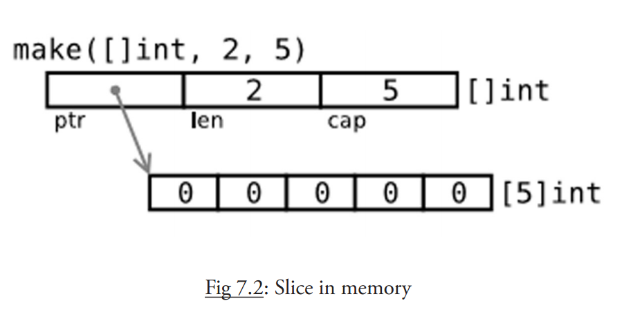

这章我们开始剖析 容器 , 它是可以包含大量条目（item）的数据结构，例如数组、切片和 map。从这看到 Go 明显受到 Python 的影响。

以`[]`符号标识的数组类型几乎在所有的编程语言中都是一个基本主力。Go 语言中的数组也是类似的，只是有一些特点。Go 没有 C 那么灵活，但是拥有切片（slice）类型。这是一种建立在 Go 语言数组类型之上的抽象，要想理解切片我们必须先理解数组。数组有特定的用处，但是却有一些呆板，所以在 Go 语言的代码里并不是特别常见。相对的，切片却是随处可见的。它们构建在数组之上并且提供更强大的能力和便捷。
# 声明和初始化
## 概念
1. 数组是具有相同 **唯一类型** 的一组已编号且长度固定的数据项序列（这是一种同构的数据结构）；
2. 数组长度必须是一个常量表达式，并且必须是一个非负整数。
3. 数组长度也是数组类型的一部分，所以 `[5]int` 和 `[10]int` 是属于不同类型的。

**注意事项** 如果我们想让数组元素类型为任意类型的话可以使用空接口作为类型。当使用值时我们必须先做一个类型判断

数组元素可以通过 **索引**（位置）来读取（或者修改），元素的数目（也称为长度或者数组大小）必须是固定的并且在声明该数组时就给出（编译时需要知道数组长度以便分配内存）；数组长度最大为 2GB。

声明的格式是： 

```go
var identifier [len]type
```

Go 语言中的数组是一种 **值类型**，可以通过 `new()` 来创建： `var arr1 = new([5]int)`。

和 `var arr2 [5]int` 的区别。arr1 的类型是 `*[5]int`，而 arr2 的类型是 `[5]int`。

在函数中数组作为参数传入时，如 `func1(arr2)`，会产生一次数组拷贝，func1 方法不会修改原始的数组 arr2。

如果你想修改原数组，那么 arr2 必须通过&操作符以引用方式传过来，例如 func1(&arr2）
## 数组常量
初始化数组

第一种：

```go
var arrAge = [5]int{18, 20, 15, 22, 16}
```

注意 `[5]int` 可以从左边起开始忽略：`[10]int {1, 2, 3}` :这是一个有 10 个元素的数组，除了前三个元素外其他元素都为 0。

第二种：

```go
var arrLazy = [...]int{5, 6, 7, 8, 22}
```

`...` 同样可以忽略，从技术上说它们其实变成了切片。

第三种：`key: value 语法`

```go
var arrKeyValue = [5]string{3: "Chris", 4: "Ron"}
```

只有索引 3 和 4 被赋予实际的值，其他元素都被设置为空的字符串
## 多维数组

## 将数组传递给函数
把一个大数组传递给函数会消耗很多内存。有两种方法可以避免这种情况：

- 传递数组的指针
- 使用数组的切片

# 切片
## 概念
切片是引用类型，表示对数组连续片段的引用（相关数组，也称匿名数组），切片提供了相关数组的动态窗口，切片的长度可变的（数组不可变）。

切片是可索引的，可以通过`len()`获取切片长度，`cap()`表示切片容量，容量=切片长度+切片之外数组的长度。切片的长度永远不会超过它的容量，所以对于切片 s 来说该不等式永远成立：`0 <= len(s) <= cap(s)`。

多个切片如果表示同一个数组的片段，它们可以共享数据；因此一个切片和相关数组的其他切片是共享存储的，相反，不同的数组总是代表不同的存储。数组实际上是切片的构建块。

声明切片的格式是： `var identifier []type`（不需要说明长度）。一个切片在未初始化之前默认为 nil，长度为 0。

切片的初始化格式是：`var slice1 []type = arr1[start:end]`。这表示 slice1 是由数组 arr1 从 `start` 索引到 `end-1` 索引之间的元素构成的子集（切分数组，start:end 被称为 slice 表达式）。

在进行切片时，你可以利用它的默认行为来忽略上下界。

切片下界的默认值为 0，上界则是该切片的长度。
对于数组
```
var a [10]int
```
来说，以下切片是等价的：
```
a[0:10]
a[:10]
a[0:]
a[:]
```
切片在内存中的组织方式实际上是一个有 3 个域的结构体：指向相关数组的指针，切片长度以及切片容量。下图给出了一个长度为 2，容量为 4 的切片 y。

- `y[0] = 3` 且 `y[1] = 5`。
- 切片 `y[0:4]` 由 元素 3，5，7 和 11 组成。


切片只能后移不能前移
```go
package main

import "fmt"

func main() {
	s := []int{2, 3, 5, 7, 11, 13}

	s = s[1:4]
	fmt.Println(s)

	s = s[:2]
	fmt.Println(s)

	s = s[1:]
	fmt.Println(s)
}
```
```     
[3 5 7]
[3 5]
[5]
```
字符串是纯粹不可变的字节数组，它们也可以被切分成切片。
## 将切片传递给函数

## 用make()创建一个切片
make 的使用方式是：`func make([]T, len, cap)`，make 接受 2 个参数：元素的类型以及切片的元素个数，其中 cap 是可选参数。

当相关数组还没有定义时，我们可以使用 make() 函数来创建一个切片，同时创建好相关数组：`var slice1 []type = make([]type, len)`。简写为 `slice1 := make([]type, len)`，这里 `len` 是数组的长度并且也是 `slice` 的初始长度,`cap(slice1) == len(slice1) == len`

如果你想创建一个 slice1，它不占用整个数组，而只是占用以 len 为个数个项，那么只要：`slice1 := make([]type, len, cap)`。

所以下面两种方法可以生成相同的切片:

```go
make([]int, 50, 100)
new([100]int)[0:50]
```

下图描述了使用 make 方法生成的切片的内存结构：


## new()和make()的区别
## 多维切片
## bytes包
# for-range结构
# 切片重组
# 切片的复制和和追加
# 字符串、数组和切片的应用